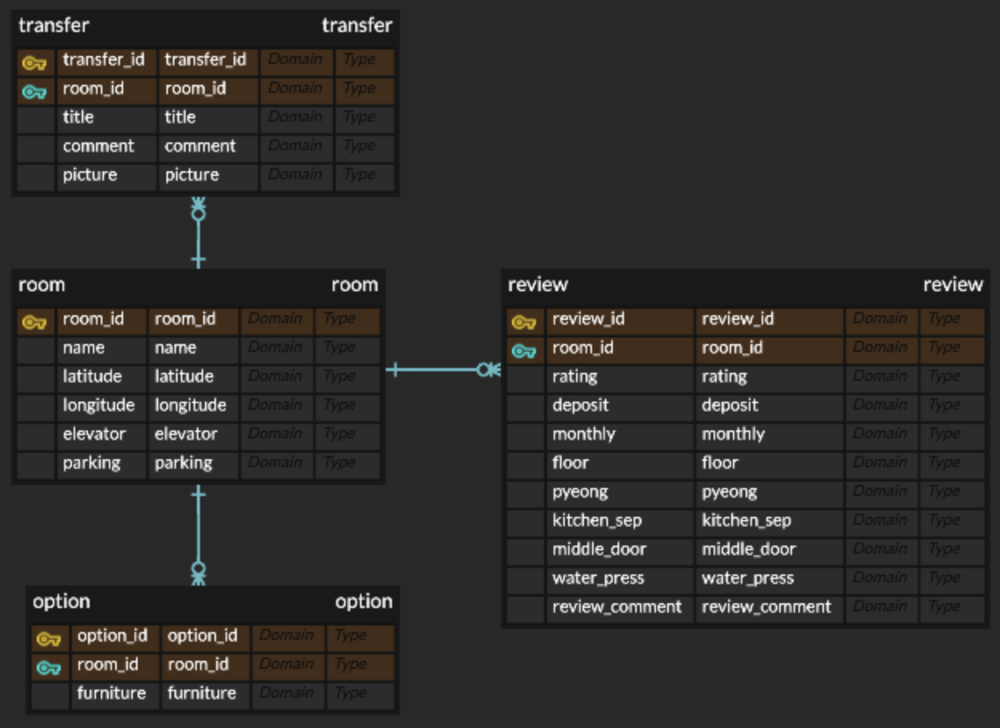

# database-web-project

## SavemeHomesJbnu



### Database Setup

To create the `SavemeHomesJbnu` database and load data from a backup file, use the following commands:

Create the database:
   ```bash
   mysql -u [username] -p -e "create database SavemeHomesJbnu";
   ```
Load data from a backup file
   ```bash
   mysql -u [username] -p SavemeHomesJbnu < SaveMeHomesJbnu_backup.sql
   ```

Need to edit

application.properties
   ```bash
  spring.datasource.username=your_db_username
  spring.datasource.password=your_db_password
   ```

index.html
   ```bash
  ncpClientId=your_naver_Application_key_Client_ID
   ```
